# 🔍 Awesome Data Discovery & Classification 🛡️

  
  
  
  

> **Curated Ecosystem of SaaS Platforms & Open-Source Tools for Sensitive Data Discovery, PII/PHI Classification, DSPM, Labeling, & Data Security Posture Management.** 🚀

---

## 📑 Table of Contents
- [🌐 SaaS / Commercial Platforms](#-saas--commercial-platforms)
- [🔓 Open-Source GitHub Projects](#-open-source-github-projects)
- [📊 Market Insights & Industry Overview](#-market-insights--industry-overview)
- [🤝 How to Contribute](#-how-to-contribute)
- [☕ Support](#-support)
- [📈 Star History](#-star-history)
- [⚠️ Disclaimer](#%EF%B8%8F-disclaimer)

---

## 📊 Market Insights & Industry Overview
The global Data Security Posture Management (DSPM) and Data Discovery market is estimated at **$2.8 Billion in 2024**, projected to reach **$11.5 Billion by 2030** (CAGR ~26.5%). The sector is **moderately fragmented**, featuring high-growth enterprise pure-plays (Cyera, BigID, Securiti) alongside major cloud providers (Microsoft Purview, IBM) expanding into native posture and classification services.

---

## 🌐 SaaS / Commercial Platforms

| Platform | Valuation / Revenue | Starting Pricing Tier | Free Tier / Trial Limit | Description |
| :--- | :--- | :--- | :--- | :--- |
| **[Microsoft Purview](https://azure.microsoft.com/products/purview/)** 🏢 | **$3 Trillion** (Market Cap) | **$0.40** / GB scanned / month (Pay-as-you-go) | **30-day free trial** with $200 Azure credits | Unified data governance, DLP & classification across Azure, M365, and multi-cloud. |
| **[IBM Guardium](https://www.ibm.com/products/guardium)** 🏢 | **$180 Billion** (Market Cap) | **$1,200** / managed server node / year | **30-day free trial** for Guardium Insights SaaS | Enterprise data security, compliance auditing & vulnerability discovery platform. |
| **[Varonis](https://www.varonis.com/)** 📈 | **$5.5 Billion** (Market Cap) | **$1,500** / monitored user / year (Est. Enterprise Starter) | **30-day Data Risk Assessment** (Free comprehensive scan) | Unstructured data security, permission governance & continuous classification. |
| **[Cyera](https://www.cyera.io/)** 🦄 | **$3.0 Billion** (Valuation) | **$25,000** / year (Enterprise Base Tier) | **14-day free cloud proof-of-concept** scan | AI-powered cloud-native DSPM for multi-cloud & SaaS data classification. |
| **[BigID](https://bigid.com/)** 🦄 | **$1.25 Billion** (Valuation) | **$15,000** / year (BigID On-Demand / Express) | **30-day free trial** (BigID Cloud Express) | Enterprise privacy intelligence, data inventory, and ML classification. |
| **[Securiti](https://www.securiti.ai/)** 🦄 | **$1.0 Billion** (Valuation) | **$10,000** / year (Data Command Center Base) | **14-day free trial** access to Data Command Center | Unified data privacy, security posture, and contextual classification platform. |
| **[Sentra](https://www.sentra.io/)** 🚀 | **$250 Million** (Valuation) | **$12,000** / year (Cloud DSPM Starter) | **14-day cloud security assessment trial** | Cloud data security posture management for automated sensitive data tracking. |
| **[Spirion](https://www.spirion.com/)** 🛡️ | **$50 Million** (Annual Revenue) | **$35** / endpoint / year | **14-day free trial** (Spirion Sensitive Data Platform) | Endpoint & server sensitive data discovery and automated classification. |
| **[Ground Labs](https://www.groundlabs.com/)** 🛡️ | **$30 Million** (Annual Revenue) | **$29** / target device / year | **30-day free evaluation license** (Enterprise Recon) | Precision sensitive data discovery & PCI-DSS/PII scanning across networks. |
| **[DataMasque](https://datamasque.com/)** 🛡️ | **$10 Million** (Annual Revenue) | **$0.15** / GB masked (AWS Marketplace) | **Free tier** up to 1GB data masking per execution | Irreversible data masking & anonymization engine for non-production data. |

---

## 🔓 Open-Source GitHub Projects

| Project | Stars | Key Features & Focus |
| :--- | :--- | :--- |
| **[Apache Atlas](https://github.com/apache/atlas)**  🌟 | Enterprise metadata management, taxonomy tagging, sensitivity classification & lineage tracking. |
| **[DataHub](https://github.com/datahub-project/datahub)**  🌟 | Extensible metadata catalog with automated PII tagging, column-level lineage & posture tracking. |
| **[OpenMetadata](https://github.com/open-metadata/OpenMetadata)**  🌟 | All-in-one metadata platform featuring auto-classification, sensitive data detection & governance. |
| **[Presidio](https://github.com/microsoft/presidio)**  🌟 | Context-aware PII detection, redaction, and anonymization engine for text, structured data & images. |
| **[Trufflehog](https://github.com/trufflesecurity/trufflehog)**  🌟 | High-performance secret scanner for finding API keys, tokens, and sensitive credentials across repos & data stores. |
| **[Amundsen](https://github.com/amundsen-io/amundsen)**  🌟 | Data discovery and metadata engine supporting metadata tagging, data previewing, and asset ownership. |
| **[PII-Leakage Engine / Scanners](https://github.com/glaucia86/pii-leakage)**  🌟 | Specialized regex and NLP detection tooling for identifying PII leaks in codebases and logs. |

---

## ☕ Support

If you find this list helpful, please consider supporting the project! Your contributions and encouragement help keep this list up to date and comprehensive. 💖

- ⭐ **Star** this repository to show your appreciation.
- 🔀 **Fork** and contribute new tools or updates.
- 📢 **Share** with privacy, security, and data governance engineers!
- ☕ **Buy Me a Coffee**: Support ongoing maintenance via the [GitHub Sponsor Dashboard](https://github.com/sponsors/ishandutta2007).

---

## 📈 Star History

---

## ⚠️ Disclaimer

- This is a **community-curated** list — not exhaustive and not an official endorsement.
- Data discovery tools process highly sensitive information. Open-source scanners are not a complete substitute for enterprise-wide DSPM programs.
- Always perform internal compliance reviews before deploying tools on production environments.

---

  <b>Made with ❤️ for Privacy, Security & Data Governance Teams Worldwide.</b>

